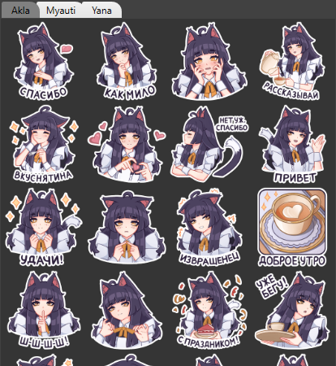
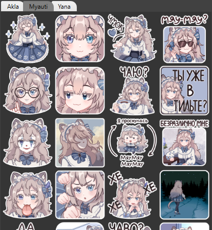
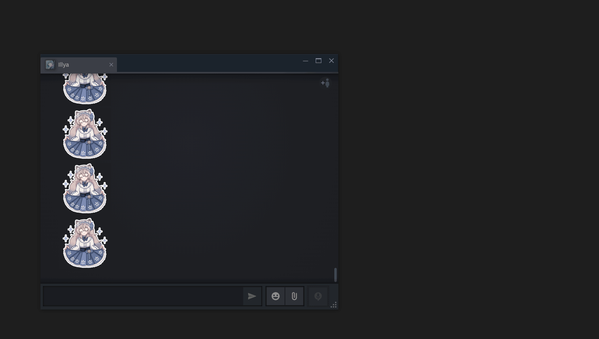

# Stickers

## About

This application is designed for conveniently sending pictures to chats like Steam, Discord, etc.

The application runs in the background and waits for the text input field in a given process to be active, then a window with images from the Stickers folder will pop up.
You need to click on any image, as a result of which the Ctrl + V, Enter buttons will be pressed in the process with the chat.

The application visually represents a table with tabs, where the tabs are the names of folders inside the Stickers folder, and the table cells are images from the corresponding folders.

## How does it work?
When the user clicks on an input field, a 1 pixel wide input caret appears.
This application determines in which process and in what position the carriage is located.
If the carriage is in one of the processes specified in config.json, then it displays the application window relative to the lower right corner of the chat window (plus offset from the config).
In this case, the focus for entering text is not lost and you can continue typing.
When you click on a sticker in the application, it disappears from view, but does not collapse (to avoid problems due to changes in focus), but hides off the screen

## Usage
Before launching the application, you need to create a Stickers folder with folders inside that will contain images and configure config.json for your processes and offsets.

### Stickers folder
For example, Stickers folder structure:
- Stickers
    - FunnyStickers
        - img1.png
        - img2.png
    - Memes
        - img1.png
        - img2.png
    - StickerPack123
        - img1.png
        - img2.png

### config.json file
config.json has property "TargetProcesses" that contains an array of object with next properties:
- Name - name of the proccess with chat (steamwebhelper, Discord, etc)
- BackgroundColor - color to change background of an image to
- RightOffset - right side offset from bottom right point of a focused process with chat
- BottomOffset - bottom side offset from bottom right point of a focused process with chat

### Execution
Just start the .exe file

### Example

## Downsides
- This was developed for my personal needs and not for general use, so this application may not be suitable for everyone.
- Because the application detects when to show itself by just caret for input, it can appear when it should not (actually there is a max height check from the bottom to detect the caret, but it's not ideal)

- Some other...